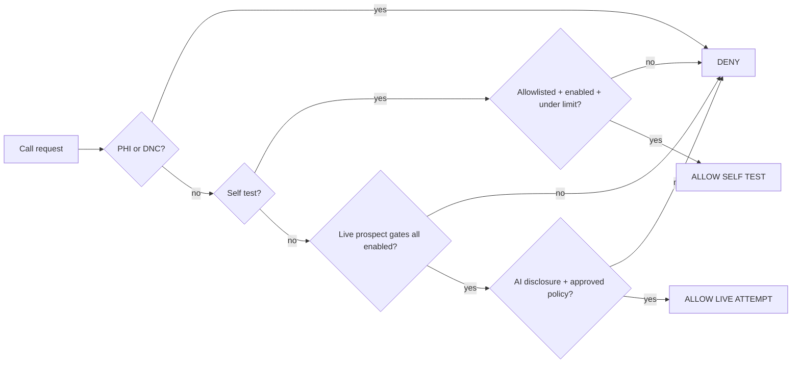

# AI Sales Call Guard

**A robot with a dial tone should have more rules than a teenager with a borrowed car.**

This repo is a sanitized public proof extracted from the guardrails built around DentSignal's outbound AI sales-call experiments. It does **not** place phone calls. It decides whether a call attempt is allowed to exist in the first place.

## What it demonstrates

- default-deny call policy;
- separate self-test and live-prospect gates;
- AI disclosure requirement;
- DNC suppression;
- no-PHI boundary for sales calls;
- allowlisted self-call destinations;
- per-day limits;
- explicit reasons for every denial.

## Workflow



The important part is the number of ways the graph can end at **DENY**.

## Run it

```bash
python -m unittest discover -s tests
```

## Tiny example

```python
from sales_call_guard.policy import CallRequest, decide

decision = decide(
    CallRequest(
        mode="self_call",
        destination="+15550000001",
        self_calls_enabled=True,
        allowed_self_numbers={"+15550000001"},
        daily_count=0,
        daily_limit=1,
    )
)

print(decision.allowed, decision.reason)
```

## Boundary

This is policy code, not a telemarketing launcher. No provider credentials, real prospect data, patient data, dialing code, SMS sender, or automatic outreach is included.

## Provenance

Sanitized and rewritten from the safety gates used in the private DentSignal codebase. The private system contains provider-specific integrations and operational evidence that are intentionally not copied here.
