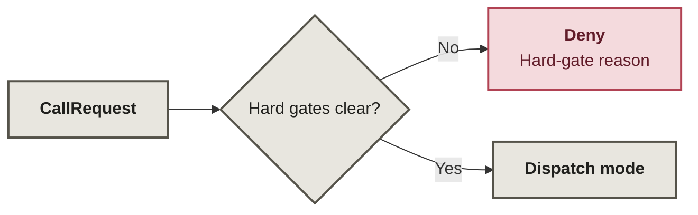
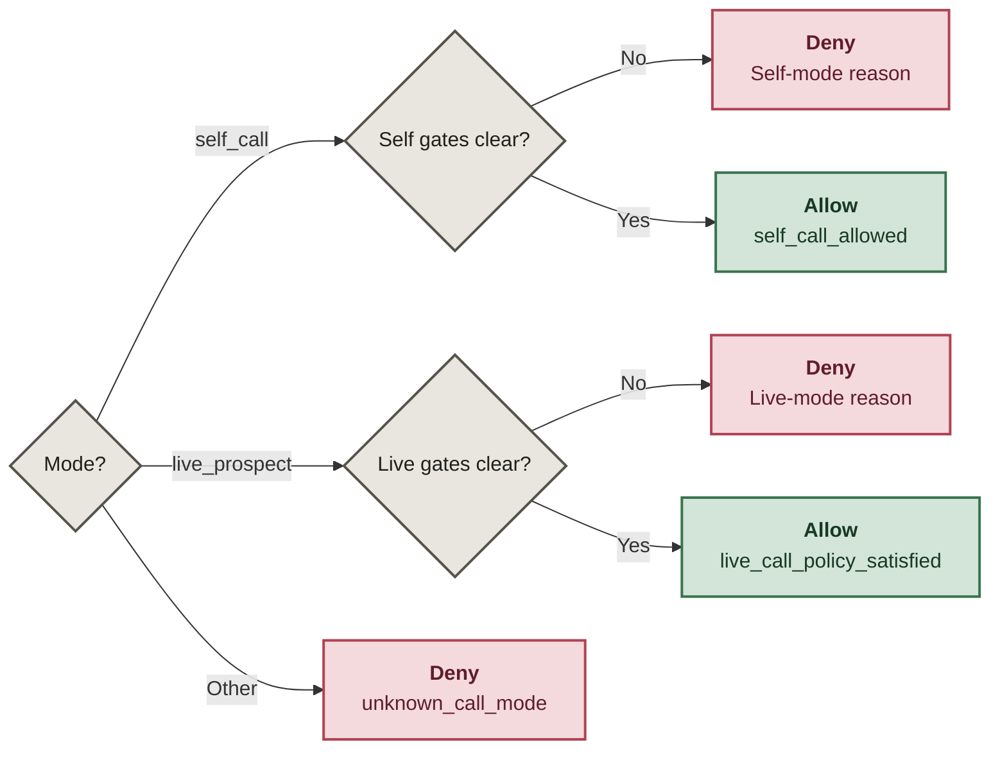

# AI Sales Call Guard

A default-deny **pre-transport policy layer** that decides whether a self-test call or an external prospect call is eligible to proceed.

**Unknown call modes do not get improvisation privileges.**

This public sample comes from guarded outbound-call experiments in my private DentSignal work. It exposes the policy decisions for review; I can build and adapt the surrounding calling workflows and provider integrations. The sample returns `Decision(allowed, reason)` and places no calls.

## Hard gates: reject before mode dispatch

PHI, destination suppression, and the daily limit are checked in that order. A refusal stops the request before any self-test or prospect-mode logic.

## Modes: enablement is specific to the call path

Self calls require their switch and an allowlisted destination. Prospect calls require the global switch, live switch, approved application-policy input, and disclosure. The table below gives the exact reasons; an unknown mode always denies.

## Decision paths

| Path | Required state | Allow reason | Representative deny reasons |
|---|---|---|---|
| Universal gates | no PHI flag, destination not suppressed, below daily limit | continue to mode dispatch | `sales_call_contains_phi`, `destination_is_suppressed`, `daily_limit_reached` |
| `self_call` | `self_calls_enabled` and destination in `allowed_self_numbers` | `self_call_allowed` | `self_calls_disabled`, `self_destination_not_allowlisted` |
| `live_prospect` | `calls_enabled`, `live_calls_enabled`, policy input equals `approved`, disclosure enabled | `live_call_policy_satisfied` | `global_sales_calls_disabled`, `live_sales_calls_disabled`, `ai_cold_call_policy_not_approved`, `ai_disclosure_missing` |
| any other mode | none | — | `unknown_call_mode` |

`ai_cold_call_policy="approved"` is an **application policy input**. It is not evidence of legal compliance, consent, or permission to call in any jurisdiction.

## Request integrity

`CallRequest` rejects blank destinations and invalid counters. It also snapshots the caller-provided self-call allowlist into a `frozenset`, so mutating the original set later cannot widen an already-created request. Those invariants stay in prose and tests rather than turning the decision diagram into a wiring closet.

## Boundary

This module owns only call-mode eligibility **before transport**. Generic agent/tool authorization happens earlier; provider dialing and realtime media behavior happen later. None of those surrounding layers are implemented here.

## Read the implementation

- [`src/sales_call_guard/models.py`](src/sales_call_guard/models.py) — validated request/decision types and immutable allowlist snapshot.
- [`src/sales_call_guard/gates.py`](src/sales_call_guard/gates.py) — universal, self-test, and external-call checks.
- [`src/sales_call_guard/policy.py`](src/sales_call_guard/policy.py) — hard-gate-first dispatch and default deny.
- [`tests/`](tests/) — behavior checks for hard gates, request integrity, both modes, and unknown-mode denial.

Verification commands and what they prove: [`docs/verification.md`](docs/verification.md).

## What this gate does not decide

This is a sanitized policy slice from guarded outbound-call experiments in private DentSignal work. Provider transport, credentials, real contact data, campaign data, and operational call flows are intentionally excluded.

See [`PROVENANCE.md`](PROVENANCE.md) for what was preserved and [`SECURITY.md`](SECURITY.md) for the public safety boundary.
