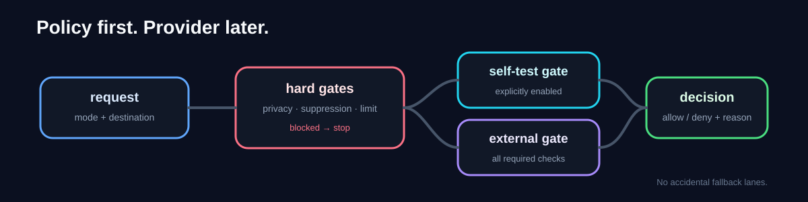

# AI Sales Call Guard

A small default-deny policy layer for deciding whether a **self-test call** or an **external prospect call** is eligible to proceed to transport.

This repository **never places a call**. It contains no provider SDK, credentials, contact list, or dialing transport. Its job ends at an explicit `Decision(allowed, reason)`.



## The problem this repo isolates

Call systems often have more than one operating mode. Permission to call an allowlisted test number should not silently become permission to contact an external destination.

`decide()` therefore applies two levels of policy:

1. **Universal pre-transport blocks** run first for prohibited sensitive context, suppressed destinations, and the daily cap.
2. **Mode-specific gates** then separate `self_call` from `live_prospect`.
3. Any unknown mode is denied by default.

This is narrower than a general agent-authorization layer and separate from realtime voice-pipeline concerns: it is specifically about **call-mode governance before transport**.

## Decision paths

| Path | Required state | Allow reason | Representative deny reasons |
|---|---|---|---|
| Universal gates | no PHI flag, not suppressed, below daily limit | continues to mode dispatch | `sales_call_contains_phi`, `destination_is_suppressed`, `daily_limit_reached` |
| `self_call` | `self_calls_enabled` and destination in `allowed_self_numbers` | `self_call_allowed` | `self_calls_disabled`, `self_destination_not_allowlisted` |
| `live_prospect` | `calls_enabled`, `live_calls_enabled`, policy input equals `approved`, and disclosure enabled | `live_call_policy_satisfied` | `global_sales_calls_disabled`, `live_sales_calls_disabled`, `ai_cold_call_policy_not_approved`, `ai_disclosure_missing` |
| any other mode | none | — | `unknown_call_mode` |

`ai_cold_call_policy="approved"` is an **application policy input**. It is not evidence of legal compliance or permission to call in any jurisdiction.

## Read the implementation

- [`src/sales_call_guard/models.py`](src/sales_call_guard/models.py) — request and decision types.
- [`src/sales_call_guard/gates.py`](src/sales_call_guard/gates.py) — universal, self-test, and external-call checks.
- [`src/sales_call_guard/policy.py`](src/sales_call_guard/policy.py) — hard-gate-first dispatch and default deny.
- [`tests/`](tests/) — behavior checks for hard gates, both modes, and unknown-mode denial.

## Verify

```bash
PYTHONPATH=src python -m unittest discover -s tests
```

The CircleCI configuration runs the same behavior tests plus source compilation and public-proof file checks.

## Boundary and provenance

This is a sanitized policy slice from guarded outbound-call experiments in private DentSignal work. Provider transport, credentials, real contact data, campaign data, and operational call flows are intentionally excluded.

See [`PROVENANCE.md`](PROVENANCE.md) for what was preserved and [`SECURITY.md`](SECURITY.md) for the public safety boundary.
